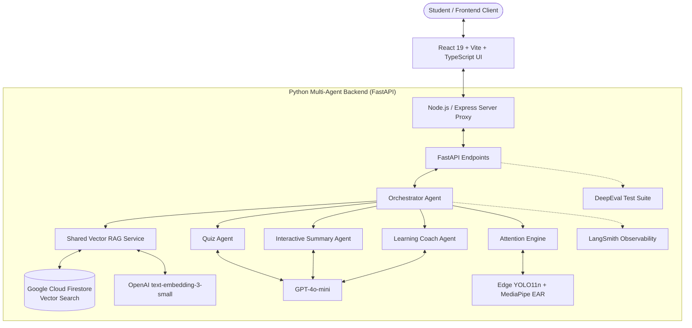
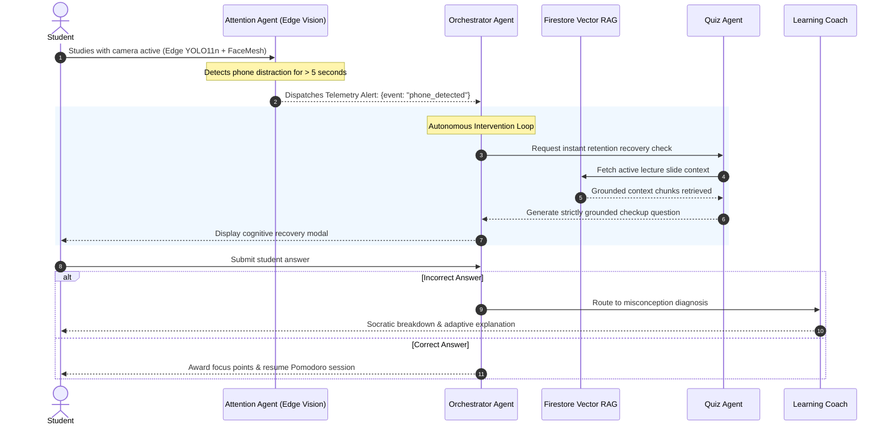

<div align="center">
   
# Attocus
### Intelligent Multi-Agent Interactive Study Companion & Cognitive Focus Platform

[-success?style=for-the-badge&logo=pytest&logoColor=white)](#testing--evaluation)
[](https://fastapi.tiangolo.com)
[](https://react.dev)
[](https://www.typescriptlang.org)
[](https://openai.com)
[](https://firebase.google.com)
[](https://smith.langchain.com)
[](https://confident-ai.com)
[](LICENSE)

<p align="center">
  <b>Attocus</b> is an intelligent, privacy-first study room designed to turn passive reading into deep mastery, active recall, and sustained attention. Powered by an orchestrated network of 4 specialized AI agents, native Cloud Firestore Vector Search (RAG), and client-side on-device computer vision attention telemetry.
</p>

<p align="center">
  
</p>

</div>

---

## Platform Interface

### 1. Interactive Study Workspace & High-DPI Canvas
Turn slides and PDF lecture notes into an active cognitive workspace with sub-pixel drawing, annotations, intelligent focus tracking, and real-time agent intervention.

<p align="center">
  
</p>

### 2. Multi-Agent Ecosystem in Action
Active recall quiz generation, reciprocal Socratic dialogue, and adaptive tutoring powered by specialized agent workflows.

| Quiz Agent (Active Recall) | Summary Agent (Socratic Reciprocal Dialogue) |
| :---: | :---: |
|  |  |

| Learning Coach (Adaptive Explanations) | Student Dashboard & Cognitive Folders |
| :---: | :---: |
|  |  |

---

## Key Features


### 1. Multi-Agent Architecture
- **Orchestrator Agent (`OrchestratorAgent`)**: Coordinates session flow, delegates cognitive tasks, and synchronizes real-time agent responses.
- **Interactive Summary Agent (`SummaryAgent`)**: Leads a reciprocal Socratic dialogue to verify comprehension and synthesize student-authored summaries for long-term retention.
- **Retention & Quiz Agent (`QuizAgent`)**: Automatically generates True/False and Multiple Choice active recall checks strictly grounded in retrieved lecture slides with zero hallucination.
- **Adaptive Learning Coach (`LearningCoachAgent`)**: Diagnoses student misconceptions and delivers adaptive, scaffolded explanations and intuitive analogies.
- **Attention & Distraction Agent (`AttentionAgent`)**: Real-time client-side phone distraction and eye closure detection using YOLO11n and MediaPipe FaceMesh (100% on-device processing).

### 2. Shared Vector RAG Engine
- **Cloud Firestore Vector Search**: Direct cosine distance vector similarity via `find_nearest` with local fallback capability.
- **Multi-Format Ingestion**: Ingestion pipeline supporting PDF documents and PowerPoint presentations (`.pptx`).
- **Semantic Chunking**: Context-aware chunking embedded via OpenAI `text-embedding-3-small` (1536 dimensions).

### 3. Enterprise Evaluation & Observability
- **LangSmith Tracing**: Real-time monitoring of agent run chains, latency, and token consumption (`@traceable_agent`).
- **DeepEval CI/CD Validation**: 78 automated evaluation checks achieving a 100% pass rate across Faithfulness (>0.7), Answer Relevancy, and Zero Hallucination benchmarks.

### 4. Interactive Study Room
- High-DPI Canvas Engine with sub-pixel precision drawing, pens, and highlighters.
- Integrated Pomodoro focus timer with gamified focus points and session rewards.
- Full bilingual support (Arabic and English) with dark and light themes.

---

## System Architecture & Workflow

### Component Architecture



### Multi-Agent Reactive Interruption Workflow



---

## Repository Structure

```text
attocus/
├── backend/
│   ├── agents/               # 4 Specialized LLM Agents & Vision Engine
│   │   ├── orchestrator.py   # Multi-agent coordinator & intent routing
│   │   ├── quiz_agent.py     # Active recall question generation (Strict Grounding)
│   │   ├── learning_coach.py # Adaptive explanation & misconception diagnosis
│   │   ├── summary_agent.py  # Reciprocal Socratic summary synthesizer
│   │   └── attention_agent.py# Edge vision distraction & drowsiness telemetry
│   ├── services/             # Core Backend Services
│   │   ├── rag_service.py    # Cloud Firestore Vector Search (Cosine Distance)
│   │   └── ingestion.py      # PDF & PPTX parser & semantic chunker
│   ├── tests/                # 78 Enterprise test checks & DeepEval benchmarks
│   ├── run_all_tests.py      # Unified CLI test runner across all 5 test suites
│   ├── main.py               # FastAPI application entrypoint
│   └── requirements.txt      # Python backend dependencies
├── src/                      # Frontend Application (React 19 + TypeScript)
│   ├── components/           # Study Room, High-DPI Canvas, Agent Chat, Modals
│   ├── services/             # Firestore, Auth, and WebCam Vision listeners
│   └── App.tsx               # Main Single-Page Application workflow
├── server.ts                 # High-performance Express Proxy & Session State Bridge
└── package.json              # Frontend dependencies & build configurations
```

---

## Getting Started

### 1. Prerequisites
- **Node.js**: v18.0 or higher
- **Python**: v3.9 or higher
- **Git**

---

### 2. Backend Setup

1. Navigate to the backend directory:
   ```bash
   cd backend
   ```

2. Create and activate a virtual environment:
   ```bash
   python -m venv .venv
   # Windows:
   .venv\Scripts\activate
   # macOS / Linux:
   source .venv/bin/activate
   ```

3. Install dependencies:
   ```bash
   pip install -r requirements.txt
   ```

4. Configure environment variables in `backend/.env`:
   ```env
   OPENAI_API_KEY="sk-..."
   FIREBASE_SERVICE_ACCOUNT_KEY="serviceAccountKey.json"  # Optional
   LANGCHAIN_TRACING_V2="true"                          # Optional for LangSmith
   LANGCHAIN_API_KEY="lsv2_pt_..."
   LANGCHAIN_PROJECT="Attocus-Platform"
   ```

5. Launch the FastAPI server:
   ```bash
   uvicorn main:app --host 127.0.0.1 --port 8000 --reload
   ```
   The API server runs on `http://127.0.0.1:8000` with interactive documentation at `http://127.0.0.1:8000/docs`.

---

### 3. Frontend Setup

1. Return to the root directory:
   ```bash
   cd ..
   ```

2. Install dependencies:
   ```bash
   npm install
   ```

3. Start the development server:
   ```bash
   npm run dev
   ```
   The client application opens at `http://localhost:3000`.

---

## Testing & Evaluation

Attocus incorporates an end-to-end evaluation and testing suite covering 5 automated layers with **78 total evaluation checks (100% pass rate)**:

### System Reliability & Evaluation Benchmark Matrix (78 Total Checks)

| Test Suite / Layer | Validation Focus | Evaluation Engine | Total Checks | Pass Rate |
| :--- | :--- | :--- | :---: | :---: |
| **Responsible AI & Security** | Prompt Injection, SQL Injection, Jailbreaks, Data Leaks | Deterministic Guardrails | **39** | **100% Passed** |
| **Orchestration & Dynamic Routing** | Intent Classification, Session Routing, Context Flow | Pytest Suite | **13** | **100% Passed** |
| **Vector Ingestion & RAG Pipeline** | Semantic Chunking, Cosine Vector Search, Local Fallback | Vector RAG Engine | **13** | **100% Passed** |
| **Edge Vision & Distraction Telemetry** | Phone Detection, EAR Drowsiness, FPS Realtime Stability | YOLO11n + MediaPipe | **7** | **100% Passed** |
| **DeepEval Live Grounding & Faithfulness** | Zero Hallucination, Faithfulness (>0.7), Answer Relevancy | LLM-as-a-judge (GPT-4o-mini) | **6** | **100% Passed** |
| **Total Autonomous Checks** | **End-to-End Enterprise Reliability** | **Unified Test Harness** | **78 Checks** | **100.0% Passed** |

### Running the Test Suite:

- **Run all 78 automated test checks across all 5 suites:**
  ```bash
  cd backend
  python run_all_tests.py
  ```
- **Run DeepEval agentic evaluation checks only:**
  ```bash
  cd backend
  pytest tests/test_eval.py -v
  ```
- **Type-check TypeScript and React components:**
  ```bash
  npx tsc --noEmit
  ```
- **Validate production bundle build:**
  ```bash
  npm run build
  ```

---

<div align="center">
  <sub>Attocus &copy; 2026 · All Rights Reserved</sub>
</div>
